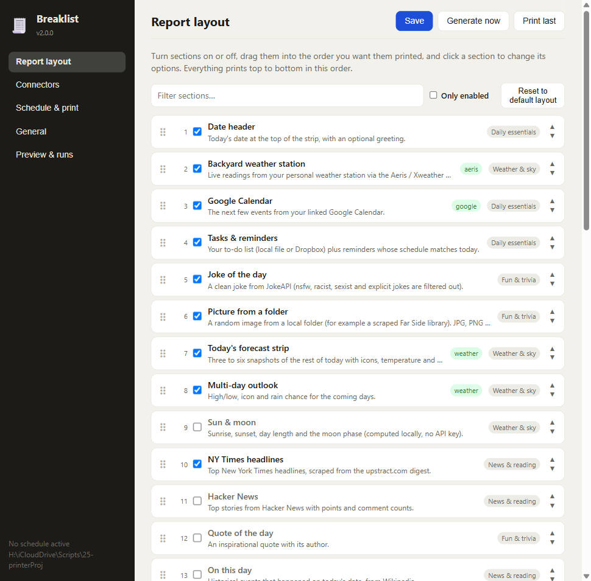
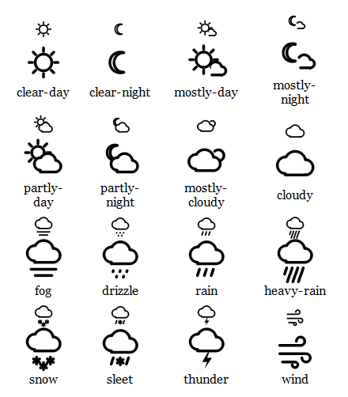

# Breaklist

A morning briefing for a receipt printer.

Every morning a 47 mm strip of thermal paper comes out with the day's calendar, the weather, the to-do list, a comic, the college football rankings, what the house sensors say, and a page of things for a three-year-old to trace, count and colour. Tear it off, stick it on the fridge, get on with the day.



## What it does

Breaklist is a single Go binary. Run `breaklist serve` and a small web app appears at `localhost:8787` where you turn sections on and off, drag them into order, tweak each one, hook up the services you use, and set a schedule. From then on it generates a PDF sized to your paper and hands it to the printer on its own.

There are about forty sections to choose from. A few that people ask about:

- **Weather** from Open-Meteo (no key needed) or Tomorrow.io, drawn with outline icons that survive a 1-bit printer.
- **Home Assistant** readings, templates and calendars. Doors print as *Open* and *Closed*, the thermostat as *Cool · 73° (set 74°)*.
- **Grafana** queries, printed as the latest value, a small table, or a ▁▂▃▅▇ sparkline.
- **Local events** merged from iCal feeds, event listing pages (Eventbrite, AllEvents, Meetup and most venue sites via their embedded schema.org data), RSS, Ticketmaster, SeatGeek and Home Assistant calendars. Each source remembers its last good result, so a broken feed falls back instead of blanking the section; see *How the events section heals itself* below.
- **A family photo**: a random picture from your library, cropped around a face by a pure-Go detector and dithered Atkinson-style.
- **Ask an AI**: a daily note, riddle or story from Claude or an OpenAI-compatible model, with placeholders for the date, the weather and the child's name.
- **Seasons and sky**: equinoxes, solstices, full moons by name, meteor showers, daylight-saving changes and holidays, computed locally.
- **Garden**: rain over the last week, heat and frost warnings, and which plants are due for water.
- **For little ones**: letter and number of the day with tracing rows, shape of the day, a fresh maze, toddler jokes, the weather in toddler words, a routine checklist, a doodle box and a Pokémon.



## Getting started

You need Go 1.22+ and [wkhtmltopdf](https://wkhtmltopdf.org/downloads.html), which does the HTML-to-PDF work.

```sh
git clone https://github.com/groblox/breaklist-lp.git
cd breaklist-lp
make
./build/breaklist open
```

The browser opens on the layout editor. Set your coordinates and time zone under **General**, connect whatever you use under **Connectors** (each card has a test button), pick your sections, and press **Generate now**. When it looks right, add a schedule under **Schedule & print**.

Settings live in `breaklist.json` next to the binary. Secrets stay on your machine.

## Printing

Anything that can print a PDF works. The print command is configurable; the defaults send the file to the system's default printer (`lp` on macOS and Linux, the PDF viewer's print verb on Windows). Page width and bottom margin are settings, so 58 mm and 80 mm paper work too.

## Sending a note to print

Not everything is a morning report. Type text into the GUI, message a Telegram bot, or `curl` a token-authenticated endpoint, and Breaklist prints just that text — same paper, same wkhtmltopdf pipeline, no report attached.

- **Telegram** — create a bot with [@BotFather](https://t.me/BotFather), paste its token into the Connectors tab, and message it. Long polling means nothing is exposed to the internet; the bot tells an unrecognized chat its id so you can add it to the allow list.
- **HTTP** — generate a token in the Connectors tab and `POST /print-text` with an `Authorization: Bearer` header to a second listener on its own port (default 8788), separate from the unauthenticated GUI port. Good for Shortcuts, Home Assistant automations, or a script over Tailscale.

Every note is logged — source, text, success or failure — under "Notes printed" in the Preview tab.

## Scheduling

Schedules have a time, weekdays, and an optional list of sections, so an evening run can print just the kids page. If the computer was asleep at the scheduled time, the run is caught up within a window you choose. Failed runs are retried, and you can ask it not to print when any section failed. State is persisted, so a restart never double-prints.

## Adding a section

Sections are Go types that implement a two-method interface: `Info()` describes the options, `Render()` returns an HTML fragment. Register it in `init()` and the GUI grows a settings form for it automatically.

```go
func (myModule) Info() modules.Info {
    return modules.Info{ID: "hello", Name: "Hello", Category: modules.CatFun,
        Fields: []modules.Field{{Key: "who", Label: "Who", Type: modules.FieldText, Default: "world"}}}
}

func (myModule) Render(ctx context.Context, env *modules.Env, opt modules.Options) (*modules.Section, error) {
    return modules.Exec("hello", helloTpl, opt.Str("who", "world"), 20)
}
```

See [docs/DEVELOPMENT.md](docs/DEVELOPMENT.md) for the layout of the code and [docs/ARCHITECTURE.md](docs/ARCHITECTURE.md) for how a report is put together.

## How the events section heals itself

Local event sources are the flakiest thing a morning printout depends on: sites change platforms, feeds move, a venue's server naps at 6 a.m. The aggregator is built so none of that blanks the section.

- **Every source is isolated.** Sources are fetched in parallel, each with its own timeout, and a failure in one never touches the others.
- **Retries with back-off inside a fetch.** Each download is tried three times (1 s, 3 s, 9 s apart) before it counts as a failure.
- **Wrong URL, right idea.** Given an HTML page instead of an iCal feed, it looks for the feed the page advertises (`<link>`/`href` ending in `.ics`), then tries the WordPress `?ical=1` convention. `webcal://` is rewritten to `https://`. Feeds with a BOM, folded lines, Windows time-zone names, `DURATION` instead of `DTEND`, cancelled entries and recurrence rules with exceptions all parse.
- **Three ways to read a page.** A listing page is mined for schema.org `Event` objects in its JSON-LD. If there are none, a festival's own homepage is treated as a single event using its Open Graph or Facebook-event meta tags, or the page title plus the first date or date range in its text ("September 18-27, 2026").
- **RSS dates from prose.** News feeds rarely carry event dates as data, so the title, summary and article body are scanned for "Sept. 26", "October 3rd at 6:30 pm", "Sept. 18–27" or "9/26" style dates, and WordPress feeds are paged back a few pages since each returns only ten posts (feeds that repeat themselves are noticed and paging stops).
- **Roundup articles become their events.** A post like "22 weekend events: Sloss City, Fall Plant Sale + more" is fetched and split by its headings, each paired with the date in its own blurb or inherited from the day divider above it, so the plant sale, the state fair and each Oktoberfest print as separate entries with the right days. A roundup that cannot be split is left out rather than printed as a fake event.
- **Venue pages without feeds.** A Squarespace-style list (heading plus `<time>` tags for date, start and end) is read directly, so a brewery or market's own events page works with no feed at all.
- **Last good copy.** Every source's result is cached on disk with a timestamp. When a fetch fails, the cached events (up to three weeks old) are used and the printout gets a small "(1 source unavailable)" note instead of a hole.
- **Circuit breaker.** A source that keeps failing is paused with a growing back-off (10 minutes, 20, 40 … up to 12 hours), still serving its cached copy, so a dead feed stops adding 25 seconds to every run. One success resets it.
- **Merging that forgives.** Events are deduplicated by their first three meaningful words on the same day, so "Wu-Tang Clan at the Amphitheater" and "Wu-Tang Clan Tickets" become one entry; season-long exhibitions and every-day listings are dropped; keywords you choose ("oktoberfest, festival, kids") float to the top; and a per-source cap keeps one busy feed from crowding out the rest.
- **Nothing to show is not an error.** If every source is down and nothing is cached, the section is skipped and the rest of the report still prints.

## Notes

- Everything except the connectors you configure runs without API keys: jokes, quotes, trivia, xkcd, Pokémon, Wikipedia, Hacker News, ESPN, sunrise times, holidays, crypto prices, people in space.
- Pictures are resized and dithered before they reach the printer; JPEG orientation is honoured.
- The page height is measured, not guessed, so the strip is exactly as long as the content.
- Logs go to `output/breaklist.log` and are visible in the GUI.
- If the data folder lives in a cloud-synced directory, Breaklist keeps a second copy of its settings in your user config folder and repairs the synced one if the sync client damages it. It is still happier outside cloud sync.

## License

MIT. The weather icon PNGs in `assets/weathercodes` come from Tomorrow.io's public icon set; the face detector is [pigo](https://github.com/esimov/pigo).
