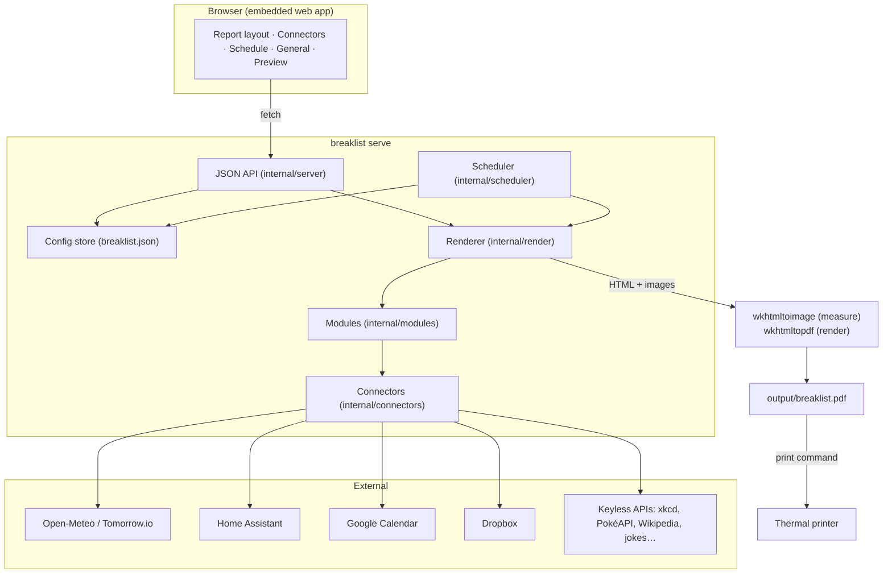

# Architecture

Breaklist 2 is a single Go binary with three responsibilities: a **report pipeline**, a **scheduler**, and an **HTTP server** that hosts the JSON API and the embedded GUI.



## Report pipeline

1. **Config** — `config.Store` loads `breaklist.json` (importing a legacy `.env` on first run) and hands out deep copies. Secrets are redacted on the way out to the GUI and merged back on save so a round-trip never blanks a token.
2. **Sections** — `cfg.Sections` is an ordered list of `{id, enabled, options}`. `modules.NormalizeSections` guarantees every registered module appears exactly once, appending newly added modules disabled so upgrades never change a layout.
3. **Modules** — each section is a `modules.Module`: `Info()` returns metadata plus an option *schema* (`[]Field`) the GUI renders as a form; `Render(ctx, env, options)` returns an HTML fragment and a rough pixel-height estimate. Modules run **concurrently** with a 45 s timeout each; a failing module is logged and skipped so one dead API never blocks the morning print. `Env` shares the forecast between weather modules and exposes unit helpers and a per-day seed for "of the day" picks.
4. **Page** — `render.Page` wraps the fragments in the page template (CSS sized for the paper width). Inline `data:` images are written to `output/img/` because wkhtmltopdf ignores data URIs in `src`.
5. **Fit** — `wkhtmltoimage` renders the page to a PNG whose height equals the content height, giving an accurate paper length; `wkhtmltopdf` then renders at that height, and the page count is checked and the height grown until the report is one page.
6. **Print** — the configured command runs with `{pdf}` substituted.

## Scheduler

`scheduler.Scheduler` ticks every 20 s, compares the local time with each enabled schedule (`HH:MM` + weekdays) and fires `generate` (+ `print`) once per schedule per day. `Next()` reports the upcoming run for the GUI sidebar.

## HTTP server

`internal/server` registers the API under `/api/…`, serves the GUI from the embedded `web/` folder and the latest output under `/output/`. OAuth flows for Google and Dropbox spin up a temporary listener on the fixed localhost port registered with each provider, exchange the code, save the refresh token and shut down.

## GUI

Vanilla HTML/CSS/JS with no build step (`internal/server/web`). It holds the config in memory, tracks a *dirty* flag, and PUTs the whole document on Save. The section list supports HTML5 drag-and-drop and ▲/▼ buttons; the options form is generated from each module's field schema; *Preview this section* posts the unsaved options to `/api/preview/{id}` and shows the rendered fragment in a 47 mm-wide iframe.

## Adding a module

```go
type myModule struct{}

func (myModule) Info() modules.Info {
    return modules.Info{ID: "my_thing", Name: "My thing", Category: modules.CatFun,
        Fields: []modules.Field{{Key: "title", Label: "Heading", Type: modules.FieldText, Default: "Hi"}}}
}

func (myModule) Render(ctx context.Context, env *modules.Env, opt modules.Options) (*modules.Section, error) {
    return modules.Exec("my_thing", myTpl, data, estimatedPx)
}

func init() { modules.Register(myModule{}) }
```

Register it, rebuild, and it appears in the GUI with a generated settings form.
